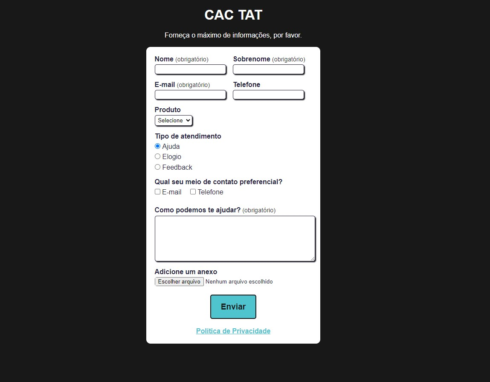

# Testes automatizados com Cypress - Básico

Projeto base apresentado no curso da [**Escola Talking About Testing**](https://udemy.com/user/walmyr), para inicialização do uso do Cypress

## O que é o Cypress?

O Cypress é um framework utilizado para automação de testes end-to-end usando JavaScript, ela foi projetada principalmente para testes de aplicações web. Ele fornece uma interface interativa, onde é possível verificar todos os testes escritos em tempo real e conforme o script de teste é incrementado, auxiliando o testador a verificar quais partes do código pode precisar de ajuste.

As vantagens de se usar o Cypress são:
- Instalação simples e uma curva de aprendizado leve
- Execução rápida dos testes, operando no mesmo ambiente do navegador instalado
- Interface iterativa, facilitando visualização e depuração dos testes

É possível realizar testes diversos tipos de testes com o Cypress, desde testes de integração até testes não funcionais como teste de performance e teste de segurança.

## Pré-requisitos

Necessário ter o Node.js e o npm instalados para execução do projeto.

> Foram utilizadas as versões `v18.17.1` para o Node.js e `9.6.7` do npm.

## Instalação

Rode o comando `npm install` para instalar as dependências.

## Testes

Os testes podem ser realizados tanto na versão Desktop quanto na versão mobile

### Desktop

Rode o comando `npm test` para executar os testes no modo headless, ou para verificar os testes na versão interativa, rode o comando `npm run cy:open`

### Mobile

Rode o comando `npm run test:mobile` para executar os testes no modo headless, ou para verificar os testes na versão interativa, rode o comando `npm run cy:open:mobile`

Foram realizados os seguintes testes na aplicação:
- Teste de verificação de titulo da página
- Preenchimento de campos obrigatórios e envio de formulário 
- Validação de máscara de e-mail 
- Validação de preenchimento com valores não numericos no campo telefone
- Validação de obrigatoriedade de telefone
- Preenchimento e limpeza de campos
- Validação de preenchimento de campos obrigatórios
- Envio de formulário com comando customizado
- Seleção do produto YouTube, pelo texto
- Seleção do produto Mentoria, pelo valor(value)
- Seleção do produto Mentoria, pelo índice
- Marcação do tipo de atendimento "Feedback" 
- Marcação de cada tipo de atendimento 
- Marcando ambos checkboxes e após desmarcando o ultimo 
- Seleção de arquivos para upload 
- Seleção de arquivos através de drag-and-drop 
- Seleção de arquivos através de um alias
- Verificação de abertura da política de privacidade abre em outra aba, sem clique
- Acesso a página de políticas, remover target e clicando no link
- Teste de verificação da página de políticas de privacidade

## Tela da aplicação testada

